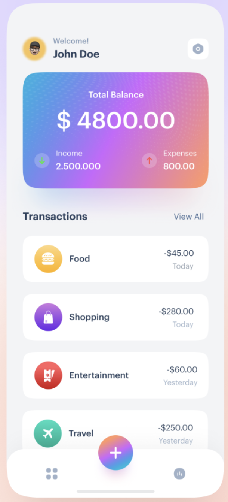
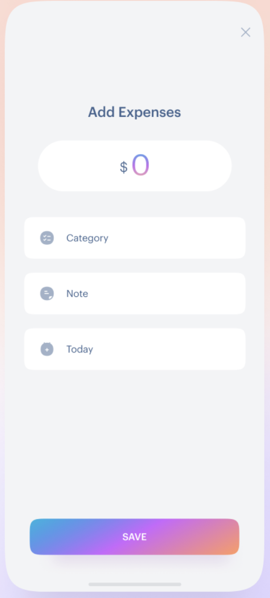
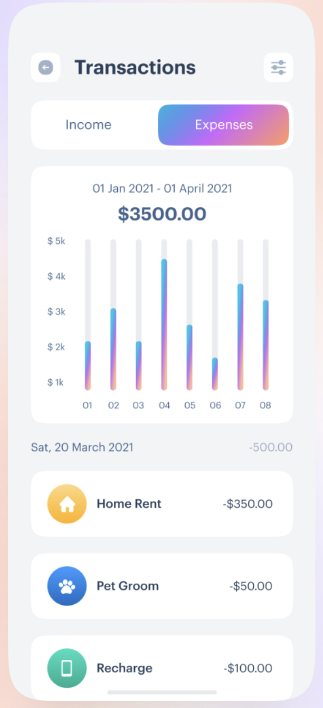

# expense_tracker_app

demo project for skils demonstration
**About project:** Expense tracker application with UI, some functionalty and Firestore database connection
**RUN GUIDE** 
* download project
* open with any SDK
* run

**SCREENSHOTS** 

